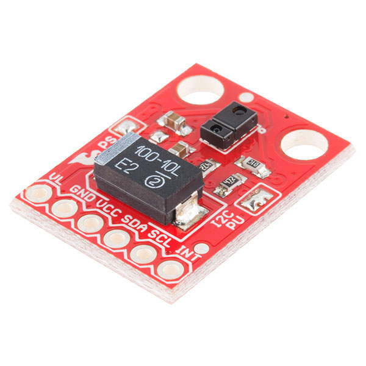

# Smart Node Pressure Washer Lance for Istobal

## Sensores
### Resumen
| NOMBRE                                                   | ENLACE DE REFERENCIA                                     | ¿EXISTE MODELO CAD?                                                                                                                                                                                                                   |
|----------------------------------------------------------|----------------------------------------------------------|---------------------------------------------------------------------------------------------------------------------------------------------------------------------------------------------------------------------------------------|
| Arduino Nano Every                                       | https://store-usa.arduino.cc/products/arduino-nano-every | [x] - [enlace 1](https://content.arduino.cc/assets/NanoEveryV30.zip?_gl=1*f0blkl*_ga*MTQzNDAzMzgwMi4xNjUyMTkzMjI5*_ga_NEXN8H46L5*MTY1MjE5MzIzMi4xLjAuMTY1MjE5MzIzMi4w) - [enlace 2](https://grabcad.com/library/arduino-nano-every-1) |
| SparkFun RGB and Gesture Sensor - APDS-9960              | https://www.sparkfun.com/products/12787                  | [x] - [enlace](https://github.com/sparkfun/3D_Models/tree/master/products/12787)                                                                                                                                                      |
| SparkFun Transceiver Breakout - nRF24L01+                | https://www.sparkfun.com/products/691                    | [x] - [enlace](https://github.com/sparkfun/3D_Models/tree/master/products/691)                                                                                                                                                        |
| OLED Breakout Board - 16-bit Color 1.5" w/microSD holder | https://www.adafruit.com/product/1431                    | []                                                                                                                                                                                                                                    |

### Sensor ADPS 9660

## Pantalla
### Adafruit SSD1351

## Comunicación
### nRF24L01+

